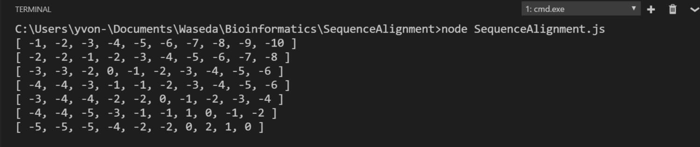

# SequenceAlignment
Authored by **SONG DAIWEI** 44161588-3

# Sequence Alignment Using Dynamic Programming (DP)

JavaScript source code:
```JavaScript 
var seq2 = "COELACANTH";
var seq1 = "PELICAN";
//initial
var matrix= new Array(seq1.length);
for(var p=0;p<seq1.length;p++)
{
    matrix[p]=new Array(seq2.length);
}

// find the value
for(var i=0;i<seq1.length;i++)
{
    for(var j=0;j<seq2.length;j++)
    {
        matrix[i][j]=maxValue(i,j)+Match(i,j);
    }
}

//output
for(var i0=0;i0<seq1.length;i0++)
{console.log(matrix[i0]);}
//find the maxValue near this grid
function maxValue(m,n)
{
    var max=0;
    if(m==0&&n==0)
        return max=0;
    if(m==0&&n>0)
        return max=matrix[0][n-1];
    if(m>0&&n==0)
        return max=matrix[m-1][0];
    if(m*n>0)
        return max=Math.max(matrix[m-1][n-1],matrix[m][n-1],matrix[m-1][n]);
}

//find the value of match function
function Match(m,n)
{
    if(seq1.charAt(m)==seq2.charAt(n))
        return 1;
    else
        return -1;
}
```
Its output result:


So the best match sequence is

| | | | | | | | | | |
|:-:|:-:|:-:|:-:|:-:|:-:|:-:|:-:|:-:|:-:|
|C|O|E|L|A|C|A|N|T|H|
| |P|E|L|I|C|A|N| | |

or

| | | | | | | | | | |
|:-:|:-:|:-:|:-:|:-:|:-:|:-:|:-:|:-:|:-:|
|C|O|E|L|A|C|A|N|T|H|
|P|_|E|L|I|C|A|N| | |

*Maybe I can use code to output the best-match path with distinguishing the gap and the mismatch.*

# Dot Matrix Analysis

## [Dottup](http://mobyle.pasteur.fr/cgi-bin/portal.py?#forms::dottup)

*Set the word size to 2 (“word size” is basically the same as “window”).  Using a word size of  2, the algorithm will scan a window of 2 amino acids and put one dot in the matrix when the two sequences have identical amino acids.  Dottup has no threshold, so it is simpler than Dotmatcher.*


## [Dotmatcher](http://mobyle.pasteur.fr/cgi-bin/portal.py?#forms::dotmatcher)

*Set the window to 10 and threshold to 23 in order to filter out the “noise.”*


## Examine the two dot matrices 
### Windows Size
**Windows=2**


**Windows=10**


**Windows Size** means the length of the piece of the sequence you use to compare to the other sequence. 

### Threshold
**Threshold=0**


**Threshold=10**


**Threshold=23**


**Threshold=50**


**Threshold** means that only the match value is bigger that threshold, will there be a dot on the diagram, which is used to filtrate the noise.


### What does the long diagonal from one corner to the other represent?  

It means that the sequence is exactly matched to itself. So there is a diagonal on the diagram. 

### What do the shorter diagonals (mostly in the lower left corner) indicate about this protein?

It means that there is some little pieces of sequence, which can be matched and its value is greater than threshold.
Like "ABCDE1234" and "123FGHIJK".
And because it is the sequence compared with itself, so its diagram is symmetric along the diagonal.
