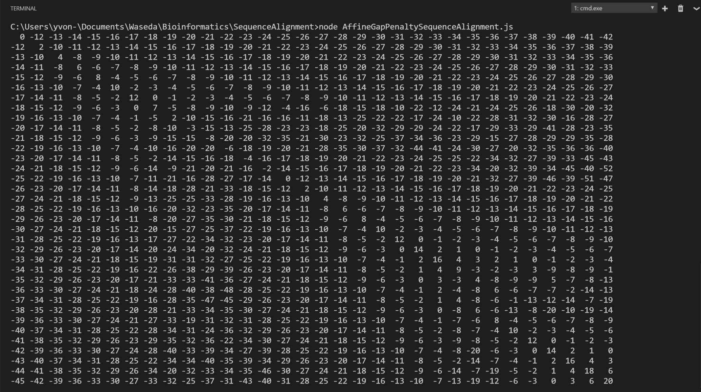
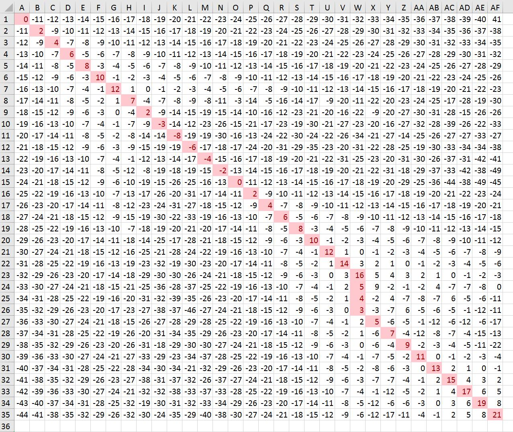
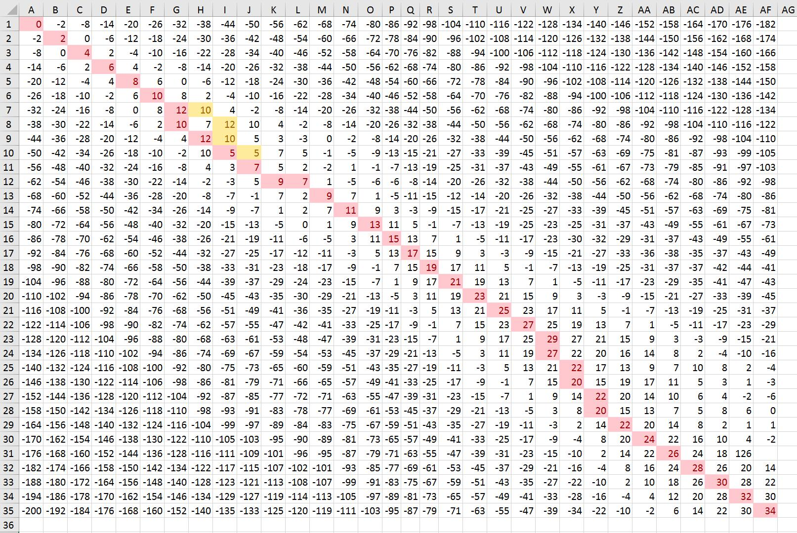

# Affine Gap Penalty Sequence Alignment
Authored by **SONG DAIWEI** 44161588-3

# Answer the following questions about scoring an alignment.

## [Affine Gap Penalty](https://en.wikipedia.org/wiki/Gap_penalty)
*Calculate the score for the DNA sequence alignment shown below, using the scoring matrix below.  Use an affine gap penalty to score the gaps, with -11 for opening the gap and -1 for each additional position in the gap.  (“Affine gap penalty” refers to a situation when the gap opening and gap extension penalties are not the same.  The gap opening penalty should be greater than the gap extension penalty.)*

```
GACTACGATCCGTATACGCACA---GGTTCAGAC        
||||||    ||||||||||||   |||||||||       
GACTACAGCTCGTATACGCACACATGGTTCAGAC          
```
| |A|G|T|C|
|-|-|-|-|-|
|A|2|-5|-7|-7|
|G|-5|2|-7|-7|
|T|-7|-7|2|-5|
|C|-7|-7|-5|2|

JavaScript source code:
```JavaScript
var seq2 = "GACTACGATCCGTATACGCACAGGTTCAGAC";
var seq1 = "GACTACAGCTCGTATACGCACACATGGTTCAGAC";
var gap_opening_penalty=-11;
var gap_extension_penalty=-1;
var matchMatrix=[
    [2,-5,-7,-7],
    [-5,2,-7,-7],
    [-7,-7,2,-5],
    [-7,-7,-5,2]
    ];

var matrix= new Array(seq1.length+1);
for(var p=0;p<seq1.length+1;p++)
{
    matrix[p]=new Array(seq2.length+1);
    for(var q=0;q<seq2.length+1;q++)
    {
        matrix[p][q]={value:null,last:null,flag:null};
    }
}

// find the value
for(var i=0;i<seq1.length+1;i++)
{
    for(var j=0;j<seq2.length+1;j++)
    {
        var result=value(i,j);
        
        matrix[i][j]={
            value:result.value,
            last:result.last,
            flag:result.flag
        }
    }
}

function value(i,j)
{
    //initial
    if(i==0&&j==0)
    {
        return {value:0,last:null,flag:null};
    }
    var value=0;
    var max=nearMax(i,j);
    
    matrix[i][j].last=max.position;
    
    if(max.position[0]==i-1 && max.position[1]==j-1)
    {    
         value=max.value+match(i,j);
         return {value:value,last:max.position,flag:"match"};
    }
    else{
        value=max.value+gap(i,j);
         return {value:value,last:max.position,flag:"gap"};
    }
    
}

//find the max value and its location near the grid
function nearMax(m,n)
{
    var max=0;
    var value=0;
    var last=null;
    if(m==0&&n>0)
        return {value:matrix[0][n-1].value,position:[0,n-1]};
    if(m>0&&n==0)
        return {value:matrix[m-1][0].value,position:[m-1,0]};
    if(m*n>0)
    {
        max=Math.max(matrix[m-1][n-1].value,matrix[m][n-1].value,matrix[m-1][n].value);
        if(max==matrix[m-1][n-1].value)
            return {value:matrix[m-1][n-1].value,position:[m-1,n-1]};
        if(max==matrix[m][n-1].value)
            return {value:matrix[m][n-1].value,position:[m,n-1]};
        if(max==matrix[m-1][n].value)
            return {value:matrix[m-1][n].value,position:[m-1,n]};
    }
}

function gap(i,j)
{
    var lp=matrix[i][j].last;
    if(matrix[lp[0]][lp[1]].flag=="gap")
        return gap_extension_penalty;
    else
        return gap_opening_penalty;
}

function match(i,j)
{   
    function AGTC(str)
    {
        if(str=="A")
            return 0;
        if(str=="G")
            return 1;
        if(str=="T")
            return 2;
        if(str=="C")
            return 3;
    };
    return matchMatrix[AGTC(seq1.charAt(i-1))][AGTC(seq2.charAt(j-1))];
}

var output= new Array(seq1.length+1);
for(var p1=0;p1<seq1.length+1;p1++)
{
    output[p1]=new Array(seq2.length+1);
}
//output
for(var i0=0;i0<seq1.length+1;i0++)
{
    for(var j0=0;j0<seq2.length+1;j0++)
    {
        var t=matrix[i0][j0].value;
        if(t >= 10)
            output[i0][j0]=" "+t;
        if(t >= 0 && t < 10)
            output[i0][j0]="  "+t;
        if(t > -10 && t < 0)
            output[i0][j0]=" "+t;
        if(t <= -10)
            output[i0][j0]=t;
    }
}
//output the matrix
for(var i1=0;i1<seq1.length+1;i1++)
{
   var row=output[i1].join(" ");
   console.log(row);
}
//TO-DO
//output the path

```

When **gap_opening_penalty = -11** and **gap_extension_penalty = -1;**

Its output:



Processed by Excel:



So its final score for the DNA sequence alignment is **21**.


## Nonaffine Gap Penalty
*How would the score change if you were to use a nonaffine gap penalty?  To answer the question, try a nonaffine penalty of -2, and then -6.*

When **gap_opening_penalty = -2** and **gap_extension_penalty = -6;**

Its output processed by Excel:



So its final score for the DNA sequence alignment is **34**.
 And its best-match path has changed.


# Answer the following questions using the BLOSUM62 matrix.

## [BLOSUM62 matrix](https://en.wikipedia.org/wiki/BLOSUM)

| |C|S|T|
|-|-|-|-|
|C|9|-1|-1|
|S|-1|4|1|
|T|-1|1|5|

*Using this matrix, two aligned cysteines (C) would receive a score of 9 while two aligned threonines (T) would only receive a score of 5.  What can you conclude about cysteine relative to threonine?*


## Another BLAST Scoring Matrix


*A serine (S) aligned with a cysteine (C) would receive a negative score (-1) while a serine aligned with a threonine would receive a positive score (1).  Offer a possible explanation for this in terms of physicochemical properties of the amino acid side chains.*

Part of BLOSUM62 matrix:


## Dynamic Programming Algorithm
*The bestng an alignment score.  Use the BLOSUM62 matrix alignment of the two amino acid sequences “LDS” and “LNS” is obvious (it’s shown below).  Given a scoring system, you could easily calculate an alignment score.  Set up a matrix and use the dynamic programming algorithm to “prove” that this is the best alignment by calculating x (see Powerpoint notes) to score aligned residues, and use a gap penalty of -1.  (You may hand write the matrix in your homework rather than typing it if you like.)*
```
seq1   LDS
       | |
seq2   LNS
```


# Example
*Find the optimal global alignment of the two sequences Seq1: THISLINE and Seq2: ISALIGNED based on the BLOSUM62 matrix with linear gap penalty of -4.*