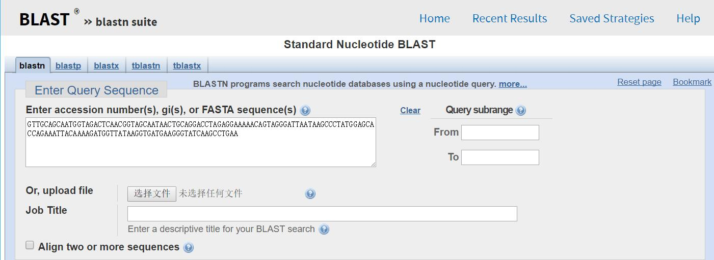

# BLAST Repot
Authored by **SONG DAIWEI** 44161588-3

# Sequence Searching and BLAST

Objective:  The goal of this module is to retrieve genetic sequence data from the NCBI database that identifies the *‘Wolbachia Sequence’* you generated. The Basic Local Alignment Search Tool (BLAST) is an essential tool for comparing a DNA or protein sequence to other sequences in various organisms.  Two of the most common uses are to 

a) determine the identity of a particular sequence and 

b) identify closely related organisms that also contain this particular DNA sequence.

**Using BLAST to identify a fake sequence and your ‘Wolbachia Sequence’**: Begin by linking to the NCBI homepage ([www.ncbi.nlm.nih.gov/](http://www.ncbi.nlm.nih.gov/)). Select **‘BLAST’** in top menu bar.  With your new knowledge of Sequence Searching and BLAST, let’s begin with a sequence you make up and then your *Wolbachia* sequence.

- **Select ‘nucleotide BLAST’** under the Basic BLAST category

- **Input your own nucleotides (A,T,G,C) that fill one complete line** into the Search Box. This is referred to as the query sequence.

- **VERY IMPORTANT - Click on the circle** for ‘Others (nr etc.) under Choose Search Set

- **Select ‘BLAST!’** at end of page. A new window appears.

- Wait for the results page to automatically launch.  The wait time depends on the type of search you are doing and how many other researchers are using the NCBI website at the same time you are!

 
 
 

1.	Did your fake sequence produce a significant alignment (probably not since a significant hit is below E-10 usually): **Yes**

    If yes, how many: **98**

1.	How many sequences did it search in the database?: **98**
1.	How many nucleotide letters did it search in the database?: **83 letters**


- **Select Home** at the top of the BLAST page.

- **Select ‘nucleotide BLAST’** under the Basic BLAST category

- **Enter your Wolbachia sequence below into the Search box.** (At this point in the lab, if students generated their own Wolbachia sequences, they could BLAST their own sequence. Here everyone will BLAST the same sequence provided to you below)

> \>Your *Wolbachia* Sequence

```
GTTGCAGCAATGGTAGACTCAACGGTAGCAATAACTGCAGGACCTAGAGGAAAAACAGTAGGGATTAATAAGCCCTATGGAGCACCAGAAATTACAAAAGATGGTTATAAGGTGATGAAGGGTATCAAGCCTGAAAAACCATTAAACGCTGCGATAGCAAGCATCTTTGCACAGAGTTGTTCTCAATGTAACGATAAAGTTGGTGATGGTACAACAACGTGCTCAATACTAACTAGCAACATGATAATGGAAGCTTCAAAATCAATTGCTGCTGGAAACGATCGTGTTGGTATTAAAAACGGAATACAGAAGGCAAAAGATGTAATATTAAAGGAAATTGCGTCAATGTCTCGTACAATTTCTCTAGAGAAAATAGACGAAGTGGCACAAGTTGCAATAATCTCTGCAAATGGTGATAAGGATATAGGTAACAGTATCGCTGATTCCGTGAAAAAAGTTGGAAAAGAGGGTGTAATAACTGTTGAAGAGAGTAAAGGTTCAAAAGAGTTAGAAGTTGAGCTGACTACTGGCATGCAATTTGATCGCGGTTATCTCTCTCCGTATTTTATTACAAATAATGAAAAAATGATCGTGGAGCTTGATAATCCTTATCTATTAATTACAGAGAAAAAATTAAATATTATTCAACCTTTACTTCCTATTCTTGAAGCTATTGTTAAATCTGGTAAACCTTTGGTTATTATTGCAGAGGATATCGAAGGTGAAGCATTAAGCACTTTAGTTATCAATAAATTGCGTGGTGGTTTAAAAGTTGCTGCAGTAAAAGCTCCAGGTTTTGGTGACAGAAGAAAGGAGATGCTCGAAGACATAGCAACTTTAACTGGTGCTAAGTACGTCATAAAAGATGAACTT
```

- Select ‘BLAST!’ A new window appears

 
 


1.	How long (query length) is the *Wolbachia* sequence that you used to search the database?: **873 letters**

1.	What is the E-value and Max score of the best hit (in this case, the first matching sequence)? 
*Wolbachia endosymbiont of Nasonia longicornis GroEL (groEL) gene, partial cds* with E-value:0.0 and Max score: **1613 bits(873)**

1.	What is the most likely identity of this sequence? (click on the blue link to the left of the top hit) 

    Wolbachia endosymbiont of Nasonia longicornis GroEL (groEL) gene, partial cds

    Sequence ID: AY714811.1
    
    Identities:873/873(100%); Gaps:0/873(0%); Strand:Plus/Plus
                    
1. What is the title of the scientific publication that reported this sequence (click on the PUBMED 16267140 link)

    **Microbiology** [PUBMED 16339946 link](https://www.ncbi.nlm.nih.gov/pubmed/16339946)


 
- *Go back twice* when you’re done.
- *Select Home* at the top of the BLAST page.
- *Select ‘nucleotide BLAST’* under the Basic BLAST category
- *Now enter only the first 135 base pairs of your *Wolbachia* sequence below into the Search box.*

> \>Your *Wolbachia* Sequence

```
GTTGCAGCAATGGTAGACTCAACGGTAGCAATAACTGCAGGACCTAGAGGAAAAACAGTAGGGATTAATAAGCCCTATGGAGCACCAGAAATTACAAAAGATGGTTATAAGGTGATGAAGGGTATCAAGCCTGAA
```

- As you did before, select ‘BLAST!’ A new window appears

 
 

1.	What is the E-value and Max score of the best hit (the first matching sequence)?
*Wolbachia endosymbiont of Nasonia longicornis GroEL (groEL) gene, partial cds* with the E-value:6e-63 and the Max score: **250**

1. What do you observe about the E-values?

    **It is a small decimal instead of a integer.**

1.	Is the identity of the best hit different from when you used the complete nucleotide sequence?
    
    **Yes, its Identities is 135/135(100%) but the Expect value is 6e-63, instead of 0.**

1. Is it the same gene as identified before?: **No**

1.	From the two BLAST searches, what can you deduce about how the length of a query sequence affects your confidence in the sequence search?  

    **If we provide the longer sequence, we can find the more exact sequence with the max score and 0 E-value.**

- Close all web windows. This exercise is now complete. You successfully mastered one of the state-of-the-art tools used by most molecular and evolutionary biology researchers today. There is a lot of information on the NCBI website. Feel free to explore the website and you can find more tutorials at: 
[www.ncbi.nlm.nih.gov/Education/BLASTinfo/information3.html](http://www.ncbi.nlm.nih.gov/Education/BLASTinfo/information3.html)


