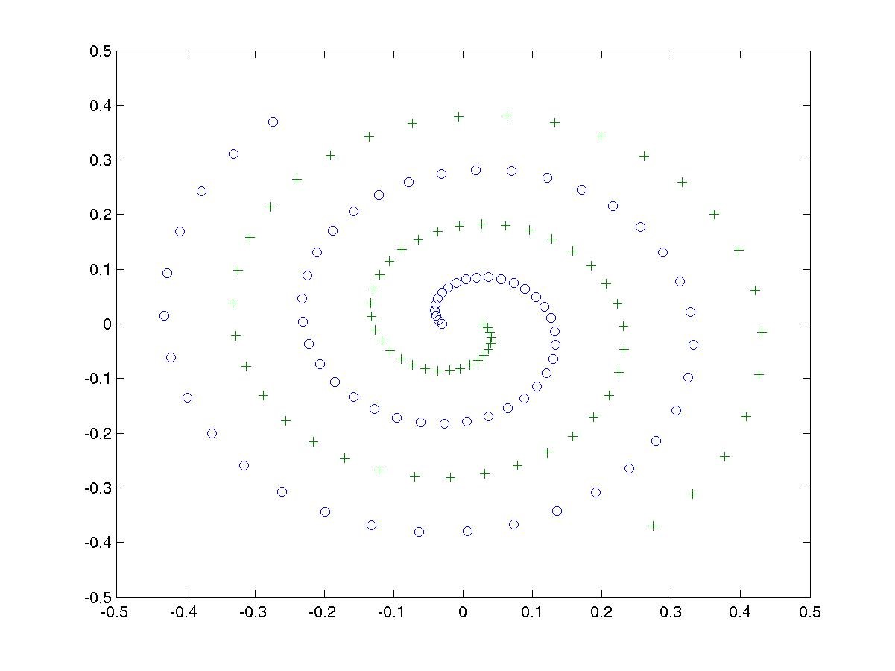

# An NN Classification Project
## SYSTEM: A Two-Nested-Spirals Problem
Two-Nest-Spirals problem is a well-known classification benchmark problem. It contains two nested spirals, ‘o’ and ‘+’, as shown in figure. The task is to separate the two nested spirals

Suppose that we have 152 associations formed by assigning the 76 points belonging to each of the nested spirals to two classes. 

## Purpose: Separating the Two Classes Using Neural Network Model

Now use a 2-layer feedforward neural network with 2 input-nodes, M hidden nodes and 1 output node. 

1. Write a program to generate the training data set. If you don’t know how to do so, use the data set “two_spiral.dat” 

2. Choose node functions for hidden nodes and output node; choose the number of hidden node M; (Hints: tanh(x) for hidden nodes, M > 16)

3. Train the neural network

-	Show the error curves for training data.

4. After training the neural network, try to show in a figure how well the trained neural network can separate the two spirals. (generalization ability)

http://www.seeker-x.com/nn-from-scratch/

http://www.cnblogs.com/wsine/p/5180365.html

http://blkstone.github.io/2015/09/27/nn-from-scratch/

https://github.com/dennybritz/nn-from-scratch

https://machine-learning-python.kspax.io/Introduction/intro.html

http://www.cnblogs.com/tornadomeet/archive/2012/06/05/2537360.html

http://www.lai18.com/content/5279941.html