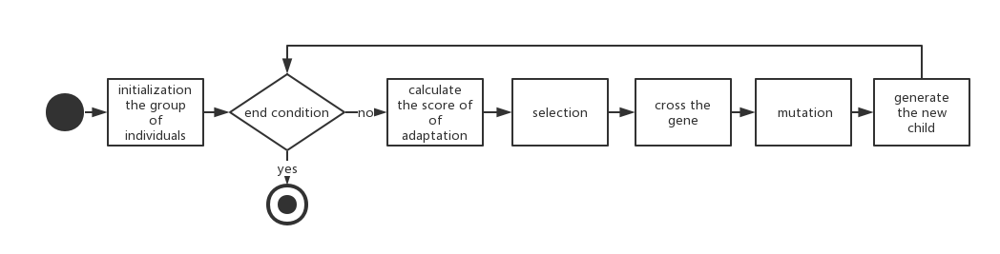
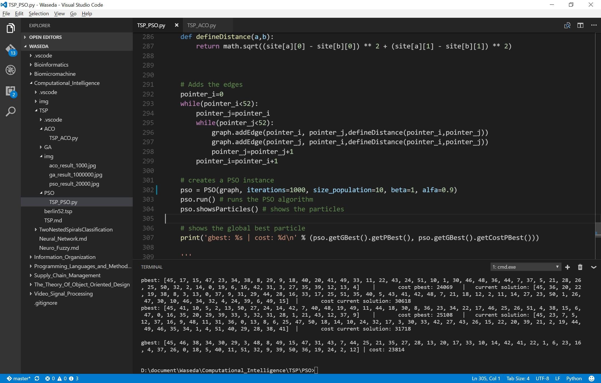

# Final Report of Computation Intelligence

Authored by **SONG DAIWEI** 44161588-3
# Travelling Salesman Problem


Given a list of cities and the distances between each pair of cities, what is the shortest possible route that visits each city exactly once and returns to the origin city?

NP-hard problem in combinatorial optimization

TSP can be regard as a graph problem can can be modelled as an undirected weighted graph:

|Cities|the graph's vertices|
|----|---|
| Paths |the graph's edges|
|The path's distance| the edge's weight|

It is a minimization problem starting and finishing at a specified vertex after having visited each other vertex exactly once. 


Because the distance in Berlin52.tsp is coordinate distance, so it is a symmetric problem.


## GA
Genetic Algorithm (GA) is a metaheuristic inspired by the process of natural selection that belongs to the larger class of evolutionary algorithms (EA). Genetic algorithms are commonly used to generate high-quality solutions to optimization and search problems by relying on bio-inspired operators such as mutation, crossover and selection.
https://en.wikipedia.org/wiki/Genetic_algorithm

### Flow chart

### Source Code


### Result


### Conclusion

## ACO


## PSO




# My trail on Two Nested Spirals Classification Problem


# Reference

https://en.wikipedia.org/wiki/Genetic_algorithm

# Appendix - Source Code in TSP
## GA
```python
import random
import math
from numpy  import *
class Individual(object):
      """class of Individual"""
      def __init__(self, aGene = None):
            self.gene = aGene
            self.score = SCORE_NONE

class GA(object):
      """class of GA"""
      def __init__(self, aCrossRate, aMutationRage, aIndividualCount, aGeneLenght, aMatchFun = lambda individual : 1):
            self.crossRate = aCrossRate
            self.mutationRate = aMutationRage
            self.individualCount = aIndividualCount
            self.geneLenght = aGeneLenght
            self.matchFun = aMatchFun                 # adaptation function
            self.population = []                           # population
            self.best = None                          # elitist selection
            self.generation = 1
            self.crossCount = 0
            self.mutationCount = 0
            self.bounds = 0.0                         # sum of adaptation to calculate the probability when selection

            self.initPopulation()


      def initPopulation(self):
            """initial the population"""
            self.population = []
            for i in range(self.individualCount):
                  gene = [ x for x in range(self.geneLenght) ] 
                  random.shuffle(gene)
                  individual = Individual(gene)
                  self.population.append(individual)


      def judge(self):
            """judge to calculate the adaptation of each individual"""
            self.bounds = 0.0
            self.best = self.population[0]
            for individual in self.population:
                  individual.score = self.matchFun(individual)
                  self.bounds += individual.score
                  if self.best.score < individual.score:
                        self.best = individual


      def cross(self, parent1, parent2):
            """cross"""
            index1 = random.randint(0, self.geneLenght - 1)
            index2 = random.randint(index1, self.geneLenght - 1)
            tempGene = parent2.gene[index1:index2]   # cross the pieces of genes
            newGene = []
            p1len = 0
            for g in parent1.gene:
                  if p1len == index1:
                        newGene.extend(tempGene)     # insert the pieces of genes
                        p1len += 1
                  if g not in tempGene:
                        newGene.append(g)
                        p1len += 1
            self.crossCount += 1
            return newGene


      def  mutation(self, gene):
            """mutation of gene"""
            index1 = random.randint(0, self.geneLenght - 1)
            index2 = random.randint(0, self.geneLenght - 1)

            newGene = gene[:]       # generate a new sequence of gene in order not to infect the father population when it mutates # Yvon-Shong 
            newGene[index1], newGene[index2] = newGene[index2], newGene[index1]    # swap
            self.mutationCount += 1
            return newGene


      def getOne(self):
            """select one Individual"""
            r = random.uniform(0, self.bounds)    # generate a real number, the threhold of evolution
            for individual in self.population:
                  r -= individual.score
                  if r <= 0:
                        return individual

            raise Exception("Wrong selection", self.bounds)


      def newChild(self):
            """generate the child"""
            parent1 = self.getOne()
            

            # cross by the probability
            rate1 = random.random()
            if rate1 < self.crossRate:
                  # cross
                  parent2 = self.getOne()
                  gene = self.cross(parent1, parent2)
            else:
                  gene = parent1.gene

            # mutate by the probability
            rate2 = random.random()
            if rate2 < self.mutationRate:
                  gene = self.mutation(gene)

            return Individual(gene)


      def next(self):
            """generate the next generation"""
            self.judge()
            newPopulation = []
            newPopulation.append(self.best)  # elitist selection, choose the best ONE to add to the next generation
            while len(newPopulation) < self.individualCount:
                  newPopulation.append(self.newChild())
            self.population = newPopulation
            self.generation += 1

class TSP(object):
      def __init__(self, aIndividualCount = 100,):
            self.initCitys()
            self.individualCount = aIndividualCount
            self.ga = GA(aCrossRate = 0.7, 
                  aMutationRage = 0.05, 
                  aIndividualCount = self.individualCount, 
                  aGeneLenght = len(self.citys), 
                  aMatchFun = self.matchFun())


      def initCitys(self):
            self.citys = []
            # import the data set of TSP
            a = loadtxt('../berlin52.tsp')  
            self.citys = a[:,1:]
            
      
      
      
      def distance(self, order):
            distance = 0.0
            for i in range(-1, len(self.citys) - 1): # -1 ???
                  index1, index2 = order[i], order[i + 1]
                  city1, city2 = self.citys[index1], self.citys[index2]
                  distance += math.sqrt((city1[0] - city2[0]) ** 2 + (city1[1] - city2[1]) ** 2)
            
            return distance


      def matchFun(self):
            return lambda individual: 1.0 / self.distance(individual.gene)   # define nonymous function


      def run(self, n = 0):
            while n > 0:
                  self.ga.next()
                  distance = self.distance(self.ga.best.gene)
                  if (n-2) %100   == 0 :
                        print (("%d : %f") % (self.ga.generation, distance))
                  n -= 1


def main():
      tsp = TSP()
      tsp.run(1000)
      


if __name__ == '__main__':
      main()

```


## ACO


```python
import random, math
from numpy  import *
import math
# class to present an edge
class Edge:

	def __init__(self, origin, destination, cost):
		self.origin = origin
		self.destination = destination
		self.cost = cost
		self.pheromone = None

	def getOrigin(self):
		return self.origin

	def getDestination(self):
		return self.destination

	def getCost(self):
		return self.cost

	def getPheromone(self):
		return self.pheromone

	def setPheromone(self, pheromone):
		self.pheromone = pheromone


class Graph:

	def __init__(self, num_vertices):
		self.num_vertices = num_vertices # The number of vertices of the graph
		self.edges = {} # The dictionary of the edges
		self.neighbors = {} # The dictionary of all the neighbors of each vertex


	def addEdge(self, origin, destination, cost):
		edge = Edge(origin=origin, destination=destination, cost=cost)
		self.edges[(origin, destination)] = edge
		if origin not in self.neighbors:
			self.neighbors[origin] = [destination]
		else:
			self.neighbors[origin].append(destination)
		
		edge_symmetry = Edge(origin=destination, destination=origin, cost=cost) # add the symmetric path with the same cost
		self.edges[(destination,origin)] = edge_symmetry
		if destination not in self.neighbors:
			self.neighbors[destination] = [origin]
		else:
			self.neighbors[destination].append(origin)
		


	def getCostEdge(self, origin, destination):
		return self.edges[(origin, destination)].getCost()

	def getPheromoneEdge(self, origin, destination):
		return self.edges[(origin, destination)].getPheromone()

	def setPheromoneEdge(self, origin, destination, pheromone):
		self.edges[(origin, destination)].setPheromone(pheromone)

	def getCostPath(self, path):
		cost = 0
		for i in range(self.num_vertices - 1):
			cost += self.getCostEdge(path[i], path[i+1])
		# Add the final cost
		cost += self.getCostEdge(path[-1], path[0])
		return cost


class GraphComplete(Graph):
	# Generates a graph complete
	def generate(self):
		for i in range(0, self.num_vertices):
			for j in range(0, self.num_vertices):
				if i != j:
					peso = random.randint(1, 10)
					self.addEdge(i, j, peso)


class Ant:

	def __init__(self, city):
		self.city = city
		self.solution = []
		self.cost = None

	def getCity(self):
		return self.city

	def setCity(self, city):
		self.city = city

	def getSolution(self):
		return self.solution

	def setSolution(self, solution, cost):
		# update the solution
		if not self.cost:
			self.solution = solution[:]
			self.cost = cost
		else:
			if cost < self.cost:
				self.solution = solution[:]
				self.cost = cost

	def getCostSolution(self):
		return self.cost


class ACO:

	def __init__(self, graph, num_ants, alpha=1.0, beta=5.0, iterations=10, evaporationRate=0.5):
		self.graph = graph
		self.num_ants = num_ants
		self.alpha = alpha # The importance of the pheromone
		self.beta = beta # The importance of the heuristic information
		self.iterations = iterations # The amount of iterations
		self.evaporationRate = evaporationRate # The rate of evaporation
		self.ants = [] # The list of ants

		list_citys = [city for city in range(0, self.graph.num_vertices)]
		# Creates the ants by putting each one in a city.
		for k in range(self.num_ants):
			city_ant = random.choice(list_citys)
			list_citys.remove(city_ant)
			self.ants.append(Ant(city=city_ant))
			if not list_citys:
				list_citys = [city for city in range(0, self.graph.num_vertices)]


		# Calculates the greedy cost to use in the pheromone initialization
		cost_greedy = 0.0 # cost greedy
		vertice_initial = random.randint(0, graph.num_vertices-1) # Selects a random vertex
		vertice_current = vertice_initial
		visited = [vertice_current] # The list of visited
		while True:
			neighbors = self.graph.neighbors[vertice_current][:]
			costs, option = [], {}
			for neighbor in neighbors:
				if neighbor not in visited:
					cost = self.graph.getCostEdge(vertice_current, neighbor)
					option[cost] = neighbor
					costs.append(cost)
			if len(visited) == self.graph.num_vertices:
				break
			min_cost = min(costs) # Get the lowest cost list.
			cost_greedy += min_cost # Add the cost to the total
			vertice_current = option[min_cost] # Updates the current vertex
			visited.append(vertice_current) # Marks the current as a visited vertex

		# Add the cost of the last visited of the cost_ greedy
		cost_greedy += self.graph.getCostEdge(visited[-1], vertice_initial)

		# Initializes the pheromone of all edges
		for key_edge in self.graph.edges:
			pheromone = 1.0 / (self.graph.num_vertices * cost_greedy)
			self.graph.setPheromoneEdge(key_edge[0], key_edge[1], pheromone)


	def rotate(self):

		for it in range(self.iterations):

			# List of lists of the city 's visited by each ant.
			citys_visited = []
			for k in range(self.num_ants):
				# Add the city of origin of each ant.
				citys = [self.ants[k].getCity()]
				citys_visited.append(citys)

			# For each ant builds a solution.
			for k in range(self.num_ants):
				for i in range(0, self.graph.num_vertices-1):
					# Get all the neighbors that have not been visited
					citys_not_visited = list(set(self.graph.neighbors[self.ants[k].getCity()]) - set(citys_visited[k]))
					
					# The sum of the number of city 's not visited by ant "k"
					# Will be used in the calculation of the likelihood
					somatorio = 0.0
					for city in citys_not_visited:
						# Calculates the pheromone
						pheromone =  self.graph.getPheromoneEdge(self.ants[k].getCity(), city)
						# Obtains the distance
						distance = self.graph.getCostEdge(self.ants[k].getCity(), city)
						# Add in the sum
						somatorio += (math.pow(pheromone, self.alpha) * math.pow(1.0 / distance, self.beta))

					# probabilities f choosing a path
					probabilities = {}

					for city in citys_not_visited:
						# Calculates the pheromone
						pheromone = self.graph.getPheromoneEdge(self.ants[k].getCity(), city)
						# Obtains the distance
						distance = self.graph.getCostEdge(self.ants[k].getCity(), city)
						#  Obtains the probability
						probability = (math.pow(pheromone, self.alpha) * math.pow(1.0 / distance, self.beta)) / (somatorio if somatorio > 0 else 1)
						# Add to the list of probabilities
						probabilities[city] = probability
						# print(probabilities)

					# Obtains the chosen city 
					city_chosen = max(probabilities, key=probabilities.get) 

					# Adds the chosen city to the list of citys visited by ant "K"
					citys_visited[k].append(city_chosen)

				# Updates the solution found by the ant.
				self.ants[k].setSolution(citys_visited[k], self.graph.getCostPath(citys_visited[k]))

			# updates the amount of pheromone 
			for edge in self.graph.edges:
				# The sum of the pheromones of the edge
				somatorio_pheromone = 0.0
				# For each ant "K"
				for k in range(self.num_ants):
					edges_ant = []
					# It generates all the edges travelled by the ant "K"
					for j in range(self.graph.num_vertices - 1):#changed
						edges_ant.append((citys_visited[k][j], citys_visited[k][j+1]))
					# Add the last edge
					edges_ant.append((citys_visited[k][-1], citys_visited[k][0]))
					# Check whether the edge is part of the path of the ant "K"
					if edge in edges_ant:
						somatorio_pheromone += (1.0 / self.graph.getCostPath(citys_visited[k]))
				# Calculates the new pheromone
				novo_pheromone = (1.0 - self.evaporationRate) * self.graph.getPheromoneEdge(edge[0], edge[1]) + somatorio_pheromone
				# The arrow of the new pheromone edge
				self.graph.setPheromoneEdge(edge[0], edge[1], novo_pheromone)


		# Through to get the solutions of the ants
		solution, cost = None, None
		for k in range(self.num_ants):
			if not solution:
				solution = self.ants[k].getSolution()[:]
				cost = self.ants[k].getCostSolution()
			else:
				aux_cost = self.ants[k].getCostSolution()
				if aux_cost < cost:
					solution = self.ants[k].getSolution()[:]
					cost = aux_cost
		print('solution final: %s | cost: %d\n' % (' -> '.join(str(i) for i in solution), cost))


if __name__ == "__main__":
	#song daiwei
	# Creates a graph and the number of vertices
	graph = Graph(num_vertices = 52)


	berlin52 = loadtxt('../berlin52.tsp')  
	site={}
	count_0=0
	while(count_0<52):
		site[str(int(count_0))]=[berlin52[count_0][1],berlin52[count_0][2]]
		count_0=count_0+1

	d={}
	count_1=0
	while(count_1<52):
		d[str(int(count_1))]=count_1
		count_1=count_1+1

	def defineDistance(a,b):
		return math.sqrt((site[a][0] - site[b][0]) ** 2 + (site[a][1] - site[b][1]) ** 2)

		

	# Adds the edges
	pointer_i=0
	while(pointer_i<52):
		pointer_j=pointer_i
		while(pointer_j<52):
			graph.addEdge(d[str(int(pointer_i))], d[str(int(pointer_j))],defineDistance(str(int(pointer_i)),str(int(pointer_j))))
			pointer_j=pointer_j+1
		pointer_i=pointer_i+1


	# Creates an instance of the ACO
	
	aco = ACO(graph=graph, num_ants=graph.num_vertices, alpha=1.0, beta=5.0, iterations=1000, evaporationRate=0.5)
	# rotate the algorithm
	aco.rotate()


```

## PSO

```python

# class that represents a graph
class Graph:

	def __init__(self, amount_vertices):
		self.edges = {} # dictionary of edges
		self.vertices = set() # set of vertices
		self.amount_vertices = amount_vertices # amount of vertices


	# adds a edge linking "src" in "dest" with a "cost"
	def addEdge(self, src, dest, cost = 0):
		# checks if the edge already exists
		if not self.existsEdge(src, dest):
			self.edges[(src, dest)] = cost
			self.vertices.add(src)
			self.vertices.add(dest)


	# checks if exists a edge linking "src" in "dest"
	def existsEdge(self, src, dest):
		return (True if (src, dest) in self.edges else False)


	# shows all the links of the graph
	def showGraph(self):
		print('Showing the graph:\n')
		for edge in self.edges:
			print('%d linked in %d with cost %d' % (edge[0], edge[1], self.edges[edge]))

	# returns total cost of the path
	def getCostPath(self, path):
		
		total_cost = 0
		for i in range(self.amount_vertices - 1):
			total_cost += self.edges[(path[i], path[i+1])]

		# add cost of the last edge
		total_cost += self.edges[(path[self.amount_vertices - 1], path[0])]
		return total_cost


	# gets random unique paths - returns a list of lists of paths
	def getRandomPaths(self, max_size):

		random_paths, list_vertices = [], list(self.vertices)

		initial_vertice = random.choice(list_vertices)
		if initial_vertice not in list_vertices:
			print('Error: initial vertice %d not exists!' % initial_vertice)
			sys.exit(1)

		list_vertices.remove(initial_vertice)
		list_vertices.insert(0, initial_vertice)

		for i in range(max_size):
			list_temp = list_vertices[1:]
			random.shuffle(list_temp)
			list_temp.insert(0, initial_vertice)

			if list_temp not in random_paths:
				random_paths.append(list_temp)

		return random_paths


# class that represents a complete graph
class CompleteGraph(Graph):

	# generates a complete graph
	def generates(self):
		for i in range(self.amount_vertices):
			for j in range(self.amount_vertices):
				if i != j:
					weight = random.randint(1, 10)
					self.addEdge(i, j, weight)


# class that represents a particle
class Particle:

	def __init__(self, solution, cost):

		# current solution
		self.solution = solution

		# best solution (fitness) it has achieved so far
		self.pbest = solution

		# set costs
		self.cost_current_solution = cost
		self.cost_pbest_solution = cost

		# velocity of a particle is a sequence of 4-tuple
		# (1, 2, 1, 'beta') means SO(1,2), prabability 1 and compares with "beta"
		self.velocity = []

	# set pbest
	def setPBest(self, new_pbest):
		self.pbest = new_pbest

	# returns the pbest
	def getPBest(self):
		return self.pbest

	# set the new velocity (sequence of swap operators)
	def setVelocity(self, new_velocity):
		self.velocity = new_velocity

	# returns the velocity (sequence of swap operators)
	def getVelocity(self):
		return self.velocity

	# set solution
	def setCurrentSolution(self, solution):
		self.solution = solution

	# gets solution
	def getCurrentSolution(self):
		return self.solution

	# set cost pbest solution
	def setCostPBest(self, cost):
		self.cost_pbest_solution = cost

	# gets cost pbest solution
	def getCostPBest(self):
		return self.cost_pbest_solution

	# set cost current solution
	def setCostCurrentSolution(self, cost):
		self.cost_current_solution = cost

	# gets cost current solution
	def getCostCurrentSolution(self):
		return self.cost_current_solution

	# removes all elements of the list velocity
	def clearVelocity(self):
		del self.velocity[:]


# PSO algorithm
class PSO:

	def __init__(self, graph, iterations, size_population, beta=1, alfa=1):
		self.graph = graph # the graph
		self.iterations = iterations # max of iterations
		self.size_population = size_population # size population
		self.particles = [] # list of particles
		self.beta = beta # the probability that all swap operators in swap sequence (gbest - x(t-1))
		self.alfa = alfa # the probability that all swap operators in swap sequence (pbest - x(t-1))

		# initialized with a group of random particles (solutions)
		solutions = self.graph.getRandomPaths(self.size_population)

		# checks if exists any solution
		if not solutions:
			print('Initial population empty! Try run the algorithm again...')
			sys.exit(1)

		# creates the particles and initialization of swap sequences in all the particles
		for solution in solutions:
			# creates a new particle
			particle = Particle(solution=solution, cost=graph.getCostPath(solution))
			# add the particle
			self.particles.append(particle)

		# updates "size_population"
		self.size_population = len(self.particles)


	# set gbest (best particle of the population)
	def setGBest(self, new_gbest):
		self.gbest = new_gbest

	# returns gbest (best particle of the population)
	def getGBest(self):
		return self.gbest


	# shows the info of the particles
	def showsParticles(self):

		print('Showing particles...\n')
		for particle in self.particles:
			print('pbest: %s\t|\tcost pbest: %d\t|\tcurrent solution: %s\t|\tcost current solution: %d' \
				% (str(particle.getPBest()), particle.getCostPBest(), str(particle.getCurrentSolution()),
							particle.getCostCurrentSolution()))
		print('')


	def run(self):

		# for each time step (iteration)
		for t in range(self.iterations):

			# updates gbest (best particle of the population)
			self.gbest = min(self.particles, key=attrgetter('cost_pbest_solution'))

			# for each particle in the swarm
			for particle in self.particles:

				particle.clearVelocity() # cleans the speed of the particle
				temp_velocity = []
				solution_gbest = self.gbest.getPBest() # gets solution of the gbest
				solution_pbest = particle.getPBest()[:] # copy of the pbest solution
				solution_particle = particle.getCurrentSolution()[:] # gets copy of the current solution of the particle

				# generates all swap operators to calculate (pbest - x(t-1))
				for i in range(self.graph.amount_vertices):
					if solution_particle[i] != solution_pbest[i]:
						# generates swap operator
						swap_operator = (i, solution_pbest.index(solution_particle[i]), self.alfa)

						# append swap operator in the list of velocity
						temp_velocity.append(swap_operator)

						# makes the swap
						aux = solution_pbest[swap_operator[0]]
						solution_pbest[swap_operator[0]] = solution_pbest[swap_operator[1]]
						solution_pbest[swap_operator[1]] = aux

				# generates all swap operators to calculate (gbest - x(t-1))
				for i in range(self.graph.amount_vertices):
					if solution_particle[i] != solution_gbest[i]:
						# generates swap operator
						swap_operator = (i, solution_gbest.index(solution_particle[i]), self.beta)

						# append swap operator in the list of velocity
						temp_velocity.append(swap_operator)

						# makes the swap
						aux = solution_gbest[swap_operator[0]]
						solution_gbest[swap_operator[0]] = solution_gbest[swap_operator[1]]
						solution_gbest[swap_operator[1]] = aux

				
				# updates velocity
				particle.setVelocity(temp_velocity)

				# generates new solution for particle
				for swap_operator in temp_velocity:
					if random.random() <= swap_operator[2]:
						# makes the swap
						aux = solution_particle[swap_operator[0]]
						solution_particle[swap_operator[0]] = solution_particle[swap_operator[1]]
						solution_particle[swap_operator[1]] = aux
				
				# updates the current solution
				particle.setCurrentSolution(solution_particle)
				# gets cost of the current solution
				cost_current_solution = self.graph.getCostPath(solution_particle)
				# updates the cost of the current solution
				particle.setCostCurrentSolution(cost_current_solution)

				# checks if current solution is pbest solution
				if cost_current_solution < particle.getCostPBest():
					particle.setPBest(solution_particle)
					particle.setCostPBest(cost_current_solution)
		

if __name__ == "__main__":
	#song daiwei
	# creates the Graph instance

	graph = Graph(amount_vertices=52)

	# This graph is in the folder "images" of the repository.
	
	berlin52 = loadtxt('../berlin52.tsp')  
	site=berlin52[:,1:]


	def defineDistance(a,b):
		return math.sqrt((site[a][0] - site[b][0]) ** 2 + (site[a][1] - site[b][1]) ** 2)

		

	# Adds the edges
	pointer_i=0
	while(pointer_i<52):
		pointer_j=pointer_i
		while(pointer_j<52):
			graph.addEdge(pointer_i, pointer_j,defineDistance(pointer_i,pointer_j))
			graph.addEdge(pointer_j, pointer_i,defineDistance(pointer_i,pointer_j))
			pointer_j=pointer_j+1
		pointer_i=pointer_i+1
	
	# creates a PSO instance
	pso = PSO(graph, iterations=1000, size_population=10, beta=1, alfa=0.9)
	pso.run() # runs the PSO algorithm
	pso.showsParticles() # shows the particles

	# shows the global best particle
	print('gbest: %s | cost: %d\n' % (pso.getGBest().getPBest(), pso.getGBest().getCostPBest()))


```