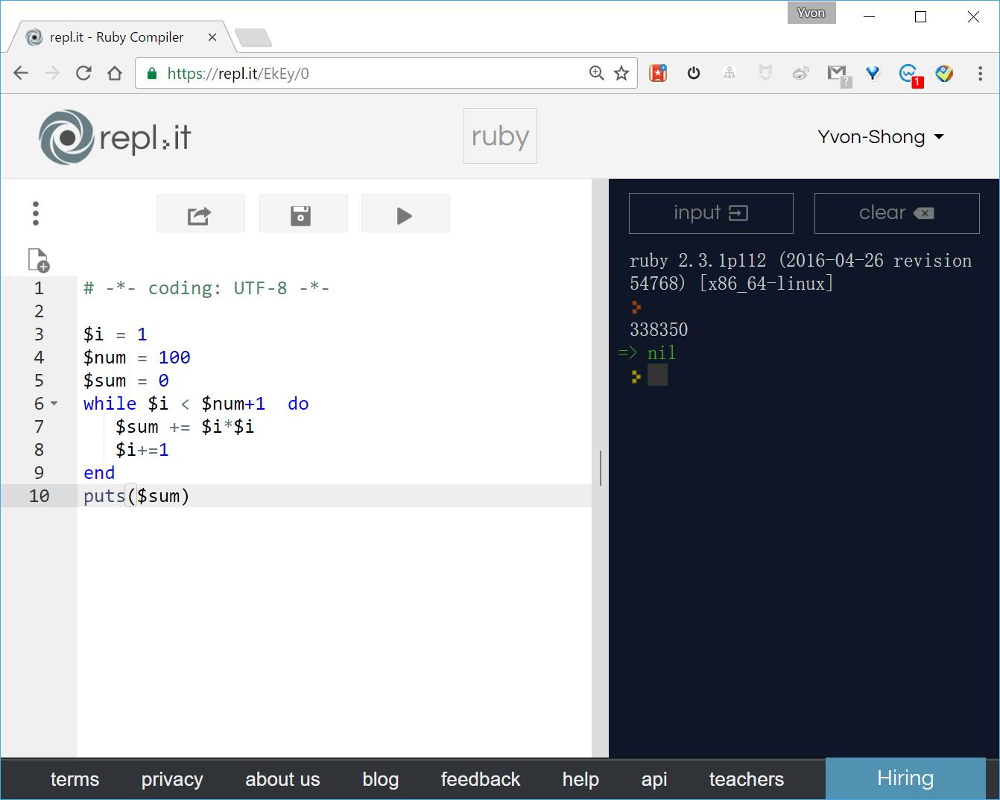
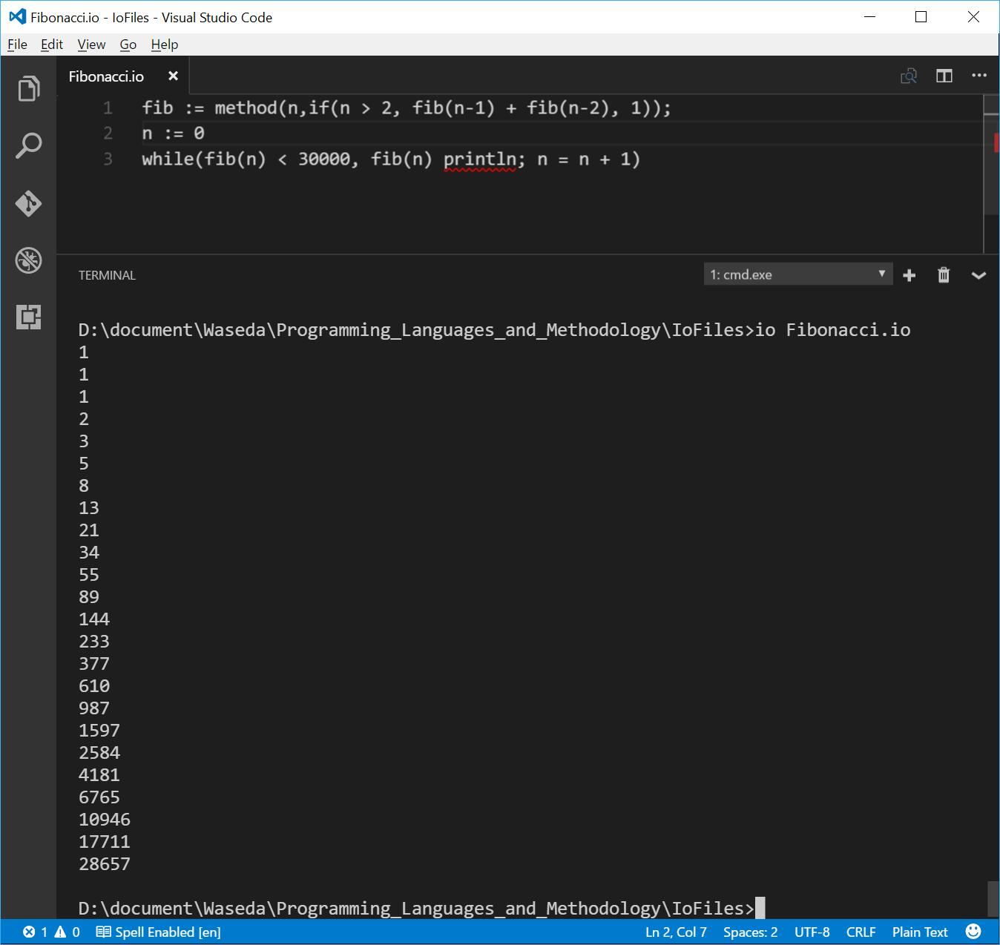
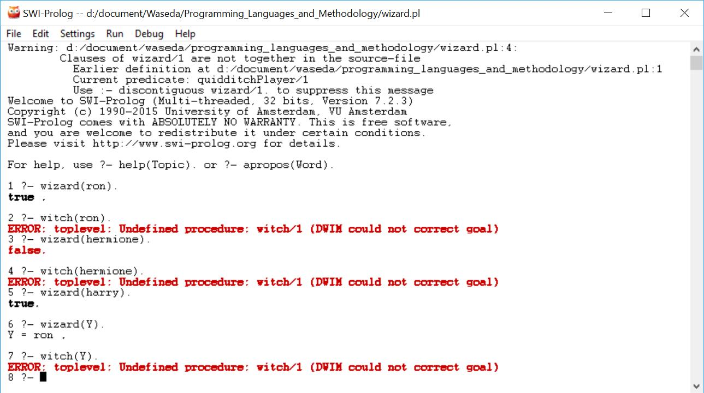

# Programming Language Report
### Authored by SONG DAIWEI  (ソウ ダイイ)  #44161588-3

Please submit the programs and execution results, which are really executed on computer.

1. Write Ruby program which computes  $1*1 + 2*2 + … + 100*100$
```Ruby
# -*- coding: UTF-8 -*-
$i = 1
$num = 100
$sum = 0
while $i < $num+1  do
   $sum += $i*$i
   $i+=1
end
puts($sum)
```



[online compiler: http://repl.it](https://repl.it/languages/ruby)

2. Write Io program which prints out all Fibonacci numbers less than 30000.

```Io
fib := method(n,if(n > 2, fib(n-1) + fib(n-2), 1));
n := 0
while(fib(n) < 30000, fib(n) println; n = n + 1)
```


reference : 

[Io tutorial](http://iolanguage.org/tutorial.html)

[Io feature](http://raytaylorlin.com/tech/language/other/io-language-1/)

3. Suppose we are working with the following knowledge base:
```Prolog
wizard(ron). 
hasWand(harry).
quidditchPlayer(harry). 
wizard(X):- hasBroom(X), hasWand(X). 
hasBroom(X):- quidditchPlayer(X).
```

Please input the above Prolog program to the computer and find the answers for the following queries. 

```Prolog
1 ?- wizard(ron).
true .
2 ?- witch(ron).
ERROR: toplevel: Undefined procedure: witch/1 (DWIM could not correct goal)
3 ?- wizard(hermione).
false.
4 ?- witch(hermione).
ERROR: toplevel: Undefined procedure: witch/1 (DWIM could not correct goal)
5 ?- wizard(harry).
true.
6 ?- wizard(Y).
Y = ron .
7 ?- witch(Y).
ERROR: toplevel: Undefined procedure: witch/1 (DWIM could not correct goal)
```



