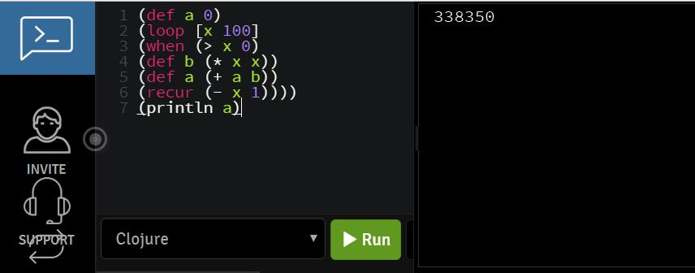
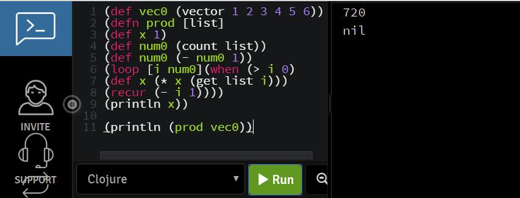
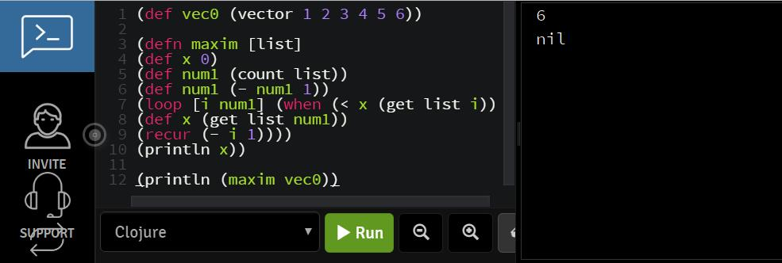

# Programming Language and Methodology Assignment#2 
SONG DAIWEI #44161588-3

Please submit the programs and execution results, which are really executed on computer.

- Write Clojure program which computes

  Online Compiler: https://codepad.remoteinterview.io/


```
1*1 + 2*2 + … + 100*100.
```

```clojure
(def a 0)
(loop [x 100]
(when (> x 0) 
(def b (* x x))
(def a (+ a b))
(recur (- x 1))))
(println a)
```



- Write the following Clojure programs. 

1. Define the function prod to find the product of all the elements of the list products of all elements.

```clojure
(def vec0 (vector 1 2 3 4 5 6))
(defn prod [list]
(def x 1) 
(def num0 (count list))
(def num0 (- num0 1))
(loop [i num0](when (> i 0)
(def x (* x (get list i)))
(recur (- i 1))))
(println x))

(println (prod vec0))


```



​	2. Define the function maxim to find the largest element in the list.

```clojure
(def vec0 (vector 1 2 3 4 5 6))

(defn maxim [list]
(def x 0)
(def num1 (count list))
(def num1 (- num1 1))
(loop [i num1] (when (< x (get list i))
(def x (get list num1))
(recur (- i 1))))
(println x))

(println (maxim vec0))
```



​	3. Define the function rev for a list with lists in reverse order.

```clojure
(def vec0 (vector 1 2 3 4 5 6))

(defn rev [list] (def list_new (rseq list))
(println list_new))

(println (rev vec0))
```


- The Euclidean algorithm (also called Euclid's algorithm) is an algorithm to determine the greatest common divisor of two integers.

C program of EGCD are as follows:

```c
int egcd(int a, int b) {  
  if (b == 0)  
    return a;  
  return egcd(b, a % b);  
}  
```

Write haskell program egcd to compute the greatest common divisor of two integers using Euclidean algorithm.

```haskell
let egcd a b = if b==0 then a else egcd b ((mod) a b)
```


