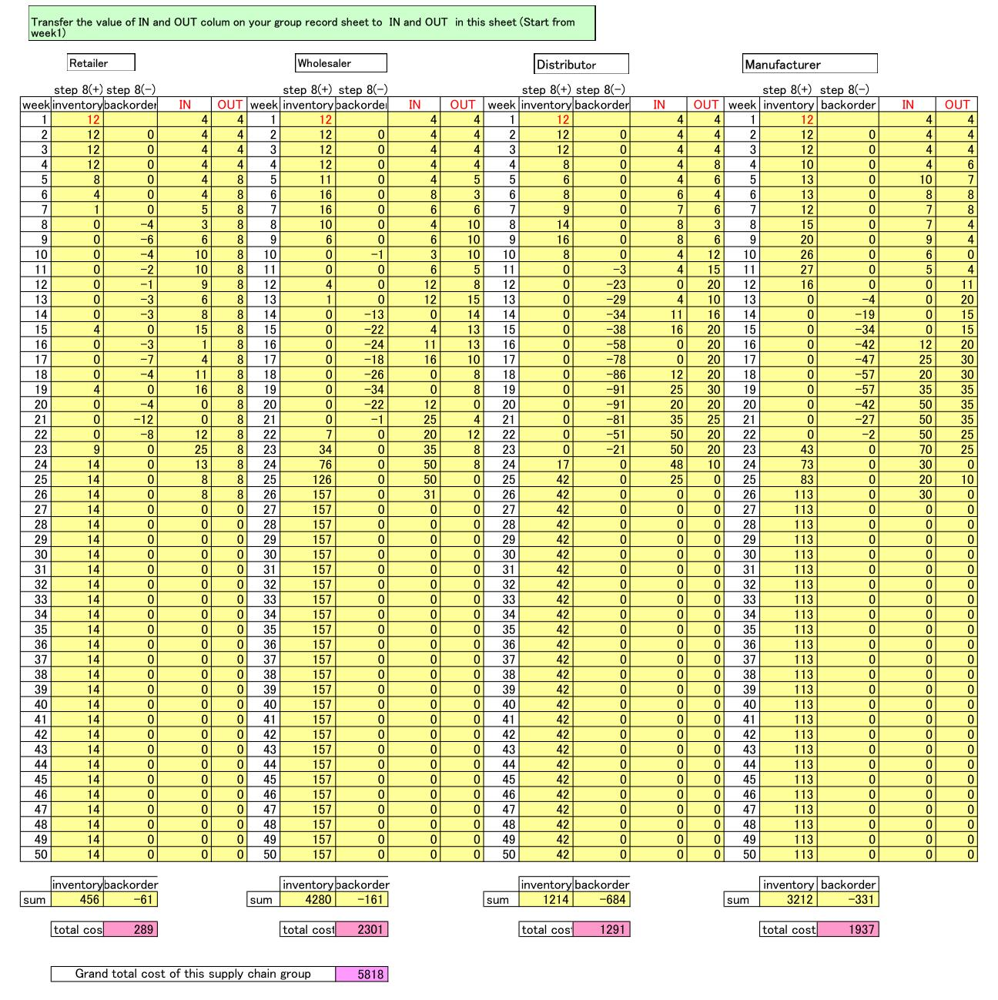
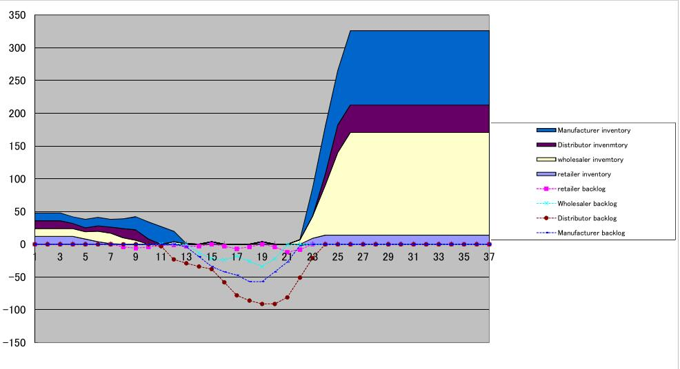

# Beer Game Report
Aurthored by **SONG DAIWEI** 44161588-3

# Beer Game

The beergame is a role-play simulation game that lets us experience typical coordination problems of (traditional) supply chains, in which information sharing and collaboration does not exist. In more general terms, this supply chain represents any non-coordinated system in which problems arise due to lack of systemic thinking.
[ \(1\) ][1]

# My Role: Wholesaler
I played the wholesaler in the game. When I was in the situation as a wholesaler, I had some difiiculty that I didn't know the next demand that the retailer needed. So sometimes I was lack of inventory. I asked for more resource next time to avoid this situation.
But because of the properties of the information in this game, hysteresis,  one-way property and spontaneity, there would be too much of inventory.
Maybe I think we should forecast the need in every link so that we could adjust the demand and inventory of us.

# My summary

Because customer demand is rarely perfectly stable, businesses must forecast demand to properly position inventory and other resources. Forecasts are based on statistics, and they are rarely perfectly accurate. Because forecast errors are given, companies often carry an inventory buffer called "safety stock".
Moving up the supply chain from raw materials supplier to end-consumer, each supply chain participant has greater observed variation in demand and thus greater need for safety stock. In periods of rising demand, down-stream participants increase orders. In periods of falling demand, orders fall or stop, thereby not reducing inventory. The effect is that variations are amplified as one moves upstream in the supply chain (further from the customer). This sequence of events is well simulated by the beer distribution game which was developed by MIT Sloan School of Management in the 1960s.

# Bullwhip effect

Research indicates a fluctuation in point-of-sale demand of +/- five percent will be interpreted by supply chain participants as a change in demand of up to +/- forty percent. Much like cracking a whip, a small flick of the wrist (a shift in point of sale demand) can cause a large motion at the end of the whip (manufacturer's response).

The bullwhip effect is a distribution channel phenomenon in which forecasts yield supply chain inefficiencies. It refers to increasing swings in inventory in response to shifts in customer demand as one moves further up the supply chain. The concept first appeared in Jay Forrester's Industrial Dynamics (1961) and thus it is also known as the Forrester effect. The bullwhip effect was named for the way the amplitude of a whip increases down its length. The further from the originating signal, the greater the distortion of the wave pattern. In a similar manner, forecast accuracy decreases as one moves upstream along the supply chain. For example, many consumer goods have fairly consistent consumption at retail. But this signal becomes more chaotic and unpredictable as you move away from consumer purchasing behavior.
[ \(2\) ][2]

# Reference

[1]
http://www.beergame.org/

[2]
https://en.wikipedia.org/wiki/Bullwhip_effect

