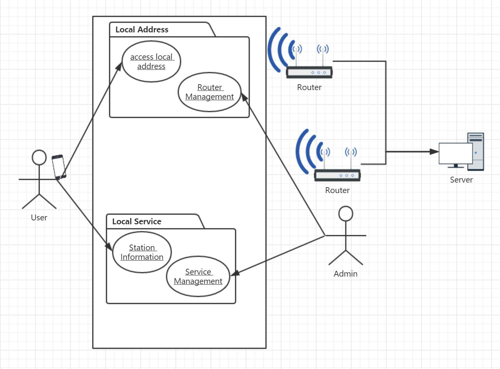

# OOD Assignment 3 
Authored by: **SONG DAIWEI**  44161588-3
# Why do we need object model and class model in OOD to develop a complex system? 

## What is an Object Model?
- The physical layout of objects in memory. E.g. the the COM ObjectModel, the JVM ObjectModel.

- The nature of objects in a programming language (including everything objects inherit from Object). E.g. the Java ObjectModel or the Smalltalk ObjectModel.

- A kind of diagram, or an incarnation of that kind of diagram. E.g. the UnifiedModelingLanguage ObjectModel diagram or the ObjectModel of an application domain.

- A specific configuration of objects at runtime. E.g. if you program in JavaScript you have different ObjectModel-s in NetscapeNavigator and InternetExplorer.

- The OMT methodology uses the term "object model" to refer the class diagrams (and instance diagrams) used to describe part or all of a system.[ \(1\) ][1]

There are four major elements of OM : Abstraction、Encapsulation、 Modularity、 Hierarchy. By major, we mean that a model without any one of these elements is not object-oriented. There are three minor elements of the OM: Typing、 Concurrency、 Persistence. By minor, we mean that each of these elements is a useful, but not essential, part of the object model.[ \(2\) ][2]

Of course, I think, Class Model is a reflection of Object Model, because Object Model emphasizes object-oriented design, and Class Model is a kind of method to realize OOD.

## Advantagement

Object Model is applicable not just to the programming languages but also to the design of User Interfaces, Databases, and even Computer Architectures.
The reason for this widespread application is that an object orientation helps to cope with the complexity (inherent in many different kinds of systems).

Unfortunately, most programmers are trained only in the principles of Structured Design (SD)
Many good engineers have developed useful software using SD
However, there are limits to the amount of complexity we can handle using only algorithmic decomposition
Thus we must turn to object-oriented decomposition.
[ \(3\) ][3]

The benefits of using the object model in complex development are:

1. It helps in faster development of software.
1. It is easy to maintain. Suppose a module develops an error, then a programmer can fix that particular module, while the other parts of the software are still up and running.
1. It supports relatively hassle-free upgrades.
1. It enables reuse of objects, designs, and functions.
1. It reduces development risks, particularly in integration of complex systems.

# Reference
[1]  http://wiki.c2.com/?ObjectModel July 7, 2014, WardCunningham

[2]  http://www.slideserve.com/linus-vasquez/object-model 

[3]  http://www.rbvi.ucsf.edu/Outreach/pc204/TheObjectModel.pdf TEF  

[1]: http://wiki.c2.com/?ObjectModel "object-model"

[2]: http://www.slideserve.com/linus-vasquez/object-model "object-model"

[3]: http://www.rbvi.ucsf.edu/Outreach/pc204/TheObjectModel.pdf  "www.rbvi.ucsf.edu The Object Model"

# Clarify the object model in order to develop the following system. (not a programing level, but need to clarify the system level)
## Problem:
*user arrives at a underground railway station that she has never visited before, carrying a smart phone that is capable of wireless networking (Wi-Fi) and a browser. She knows nothing about where she is. She can see only walls. Suggest what features the site staff needs to prepare for her to be provided with information about the local services and amenities at that station, without entering the station’s name or attributes. There is no GPS available at the underground area. There is no Internet connection. What basic technical challenges must be used? Or What kind of basic features are provided by the station administration with a certain technology?*
## Solution:
We can use the IP of routers to distinguish the address of user.
So the user can access to a website provided by the localhost in the station, and he can get his location and service information from the router linked.

And the system admin can control the routers' ip, their address information, and service information. 

In object model, we provide two object in the router, which can be accessed by the user through the smart phone.

One is the router information, which is in the charge of Admin, and user only can read.

The other object is the service information, whose authority is the same to the touter information.

