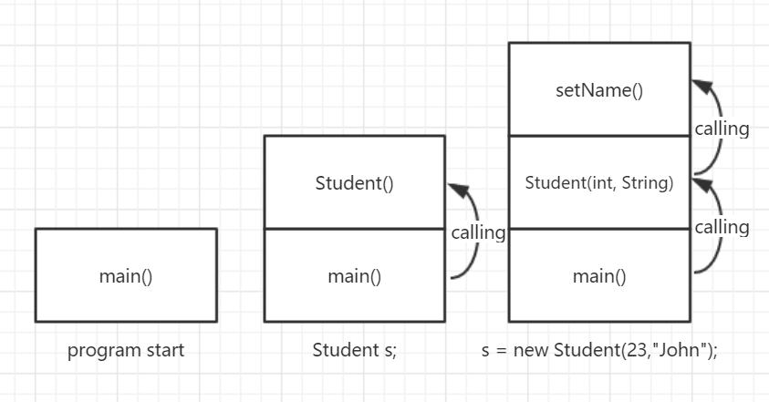
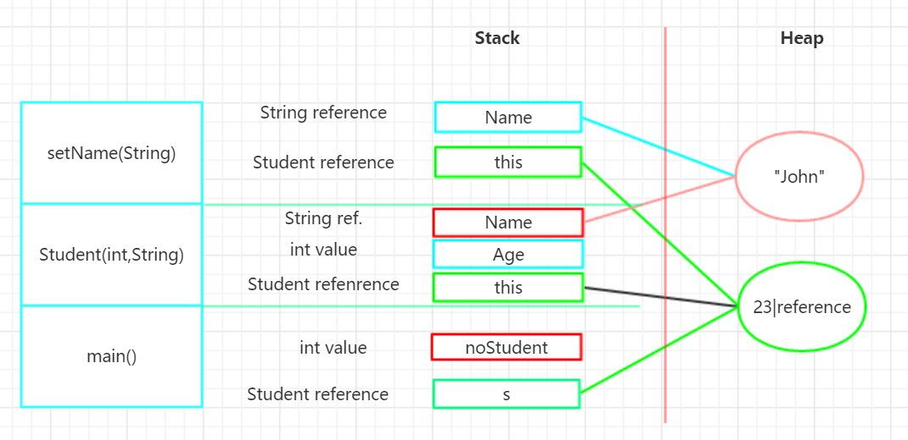

# OOD Assignment 4
Authored by: **SONG DAIWEI**  44161588-3
# How are "heap" and "stack" used in OOP? Are there any issues there?
## Stack:

The two sections other from the code segment in the memory are used for data. The stack is the section of memory that is allocated for automatic variables within functions.

Data is stored in stack using the Last In First Out (LIFO) method. This means that storage in the memory is allocated and deallocated at only one end of the memory called the top of the stack. Stack is a section of memory and its associated registers that is used for temporary storage of information in which the most recently stored item is the first to be retrieved.[ \(1\) ][1]

To summarize the stack:
- The stack grows and shrinks as functions push and pop local variables
- There is no need to manage the memory yourself, variables are allocated and freed automatically
- The stack has size limits
- Stack variables only exist while the function that created them, is running

## Heap:

On the other hand, heap is an area of memory used for dynamic memory allocation. Blocks of memory are allocated and freed in this case in an arbitrary order. The pattern of allocation and size of blocks is not known until run time. Heap is usually being used by a program for many different purposes.

The stack is much faster than the heap but also smaller and more expensive.

The heap does not have size restrictions on variable size (apart from the obvious physical limitations of your computer). Heap memory is slightly slower to be read from and written to, because one has to use pointers to access memory on the heap. We will talk about pointers shortly.

Unlike the stack, variables created on the heap are accessible by any function, anywhere in your program. Heap variables are essentially global in scope.

## Differences:

|difference|stack|heap|
|---|---|---|
|memory allocation|static, allocated by compiler to store parameter and local variables|dynamic, allocated by programmers like linked list|
|system reponse|so long as the memory is enough| a linked list to know the free memory address|
|size limitation|fixed, small|nonsequence memory regions, flexible, big|
|access speed|fast|slower than stack|
|efficiency|allocated by system, fast, out of control|slow, prone to memory fragmentation|


You can use the stack if you know exactly how much data you need to allocate before compile time and it is not too big.	You can use heap if you don't know exactly how much data you will need at runtime or if you need to allocate a lot of data.

In a multi-threaded situation each thread will have its own completely independent stack but they will share the heap. Stack is thread specific and Heap is application specific. The stack is important to consider in exception handling and thread executions.
[ \(1\) ][1]

## Issue:

### Stack
- *very fast access*
- don't have to explicitly de-allocate variables
- space is managed efficiently by CPU, memory will not become fragmented
- local variables only
- limit on stack size (OS-dependent)
- variables cannot be resized

### Heap
- *variables can be accessed globally*
- *no limit on memory size*
- relatively slower access
- no guaranteed efficient use of space, memory may become fragmented over time as blocks of memory are allocated, then freed
- you must manage memory (you're in charge of allocating and freeing variables)
- variables can be resized using *realloc()*
[ \(2\) ][2]


## Reference: 

[1]:http://net-informations.com/faq/net/stack-heap.htm
[1] http://net-informations.com/faq/net/stack-heap.htm

[2]:http://gribblelab.org/CBootcamp/7_Memory_Stack_vs_Heap.html
[2] http://gribblelab.org/CBootcamp/7_Memory_Stack_vs_Heap.html


# Describe those in case of Java considering thread.
Simple Java application in main method thread:

```Java
class Student{
    int age;         //instance variable
    String name;     //instance variable
 
    public Student()
    {
        this.age = 0;
        name = "Anonymous";
    }
    public Student(int Age, String Name)
    {
        this.age = Age;
        setName(Name);
    }
    public void setName(String Name)
    {
        this.name = Name;
    }
}
 
public class Main{
	public static void main(String[] args) {
            Student s;                   //local variable - reference
            s = new Student(23,"Jonh");
            int noStudents = 1;          //local variable
	}
}

```
In order to determine the minimum space (because we focus only on the important elements and we keep things as simple as possible) let’s analyze the Stack requirements. In the next paragraph I describe each method stack separately but in the end all these are placed on the same stack, the application stack.

We start with the main method because for a Java process everything begins and ends with main. The main local variables, or variables stored on its Stack are:

- the args reference (it is an array of Strings);
- the Student reference, named s;
- the integer (4 bytes) value, named noStudents;

The default constructor local variables are:

- the current created object reference, named this;
- that’s all (remember: the object and its values are stored in Heap).

The second constructor, the one with arguments, local variables:

- the reference of the current created object, named this;
- the input argument, Age, an integer value
- the input argument, Name, a String reference

The setName method local variables are:

- the calling object reference, named this; (remember: each non-static class method it is called by an object and that object reference is passed to the method as this)
- the input argument, Name, a String reference

All these methods stacks are in fact, parts of a single applications stack. Each part exists during the function lifetime. If you analyze the order in which these methods are called you can define a bigger picture – the process call stack.
[ \(3\) ][3]

For the previous example, when the constructor with arguments it is executed, the call stack looks like this:


As you can see, from the previous image, the call stack is generated by all the active methods. Because the main method is the process entry point, it is the first method on the call stack. After this moment, each time a method is called, it will be placed on the call stack.

For the previous example, the call stack has the maximum size when it is called the setName method from the Student constructor.

In Heap there are stored all the values that are created using new operator, meaning mostly object values. So, for the previous example, the references are stored on the method stack and the objects are stored in Heap:


In the previous image, there are described the methods local variables, which are stored on their stack. Also, you can see that objects values (the Student and the String) are stored in Heap.

The Heap values are created by:

- the Student memory area in Heap is created by calling the new operator and the class constructor;
- the String value is created during the object initialization inside the class constructor.

## Thread

[ \(4\) ][4]


Each Thread in Java has their own stack which can be specified using -Xss JVM parameter, similarly, you can also specify heap size of Java program using JVM option -Xms and -Xmx where -Xms is starting size of the heap and -Xmx is a maximum size of java heap.

Variables stored in stacks are only visible to the owner Thread while objects created in the heap are visible to all thread. In other words, stack memory is kind of private memory of Java Threads while heap memory is shared among all threads.
[ \(5\) ][5] 


## Reference

[3]:
http://www.itcsolutions.eu/2011/02/06/tutorial-java-8-understand-stack-and-heap/
[3]
http://www.itcsolutions.eu/2011/02/06/tutorial-java-8-understand-stack-and-heap/

[4]:
http://wiki.jikexueyuan.com/project/java-concurrent/java-memory-model.html
[4]
http://wiki.jikexueyuan.com/project/java-concurrent/java-memory-model.html


[5]:http://javarevisited.blogspot.com/2013/01/difference-between-stack-and-heap-java.html
[5] http://javarevisited.blogspot.com/2013/01/difference-between-stack-and-heap-java.html
