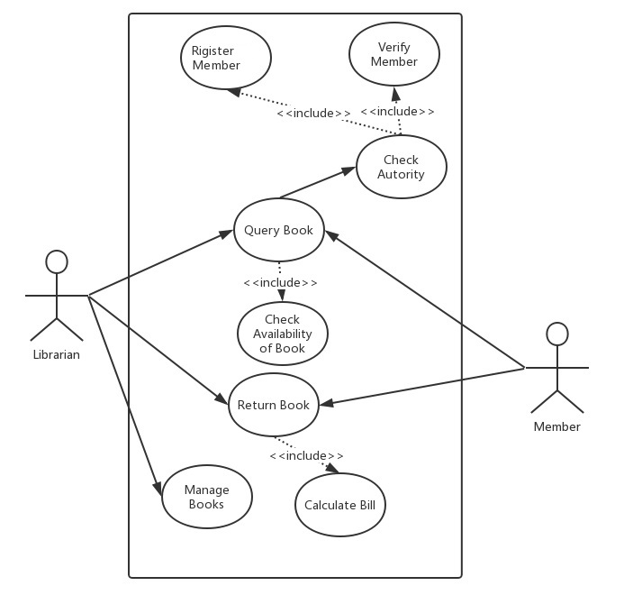
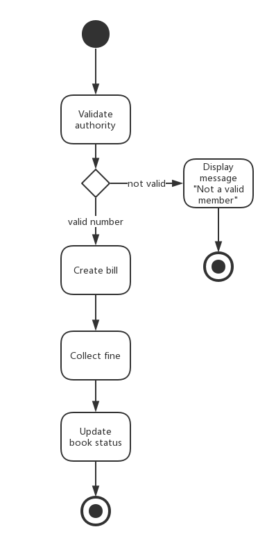

# Library Management System Design Report
Authored by: **SONG DAIWEI**  44161588-3
# Outline
I design this simple system using Java (maybe I will add Netbeans to implement GUI instead of Command Line). So I use a basic class named Account to be the father of member and libririan. Every book is a example of Book Class, and when member rewturn the book, he will pay for the bill.

## Technology selection
- Graphic User Interface
    
        Netbeans based on Java
- Database

        JDBC
- server
        
        Java

## function point
- account management
    - libririan
    - member
        - rigister
        - login
- book
    - add/delete book
    - change detail of book
    - change status of book
    - borrowTime
- bill
    - calculate the bill
    - its owner

# Development Environment
## Hardware
- Surface Pro 3 : 4GB ROM  

## Software
- Windows 10 10.0.14393
- Jetbrains IntelliJ IDEA 2016.2.4
- JDK8.0

# Design Diagram
## Use Case Diagram

## Activity Diagram for Querying Book

## Activity Diagram for Returning Book

## State diagram for Book:

## Class Diagram for Library Management System

## Deployment Diagram for Library management system

