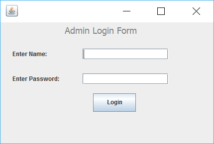
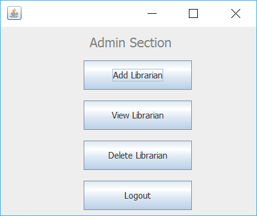
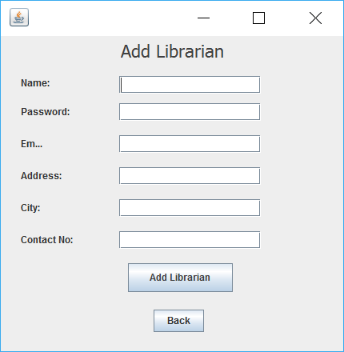
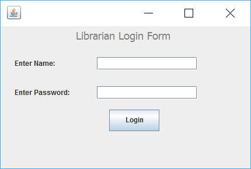

# Library Management System Manual

44161588-3 SONG DAIWEI

## Hardware Environment
- CPU: Intel x86-64
- RAM: 2GB+ 
## Software Environment
- OS: Windows 10
- JDK: JDK 7+
- **Database**: MySQL 5.*


## Manual
- Unzip the zip file
- Import the /bin/books.sql,/bin/issuebooks.sql and /bin/librarian.sql into MySQL. 
- Import the folder to the java IDE like Eclipse or IntelliJ, and **build the project** to jar file **(I suggest to do so)**. 

  *or rename the LibManSys.txt_ to LibManSys.jar, because we can't upload the attachment with .jar in the gmail.*
- And then click in LibManSys.jar to run.

### Admin Account  



| Name     | admin    |
| -------- | -------- |
| Password | admin123 |




### Librarian Account



| Name     | song   |
| -------- | ------ |
| Password | daiwei |

which can be viewed in the .sql files in the folder  /bin/ , or the librarian you created in the admin.

```SQL
INSERT INTO `librarian` (`id`, `name`, `password`, `email`, `address`, `city`, `contact`) VALUES
(1, 'song', 'daiwei', 'soudaii@moegi.waseda.jp', 'honjo', 'kitakyushu', '08042820216');
```


