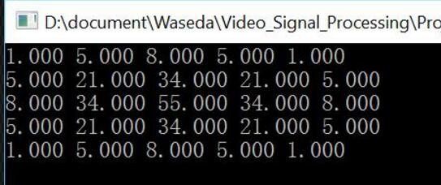
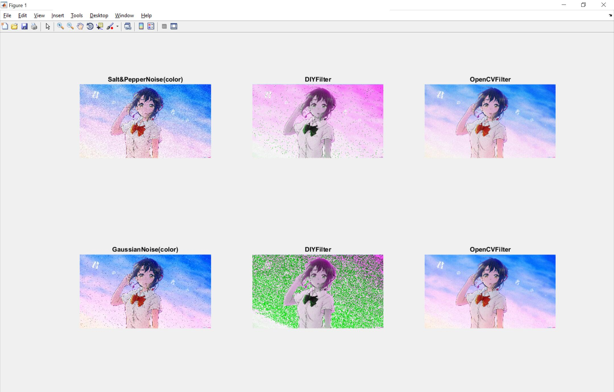
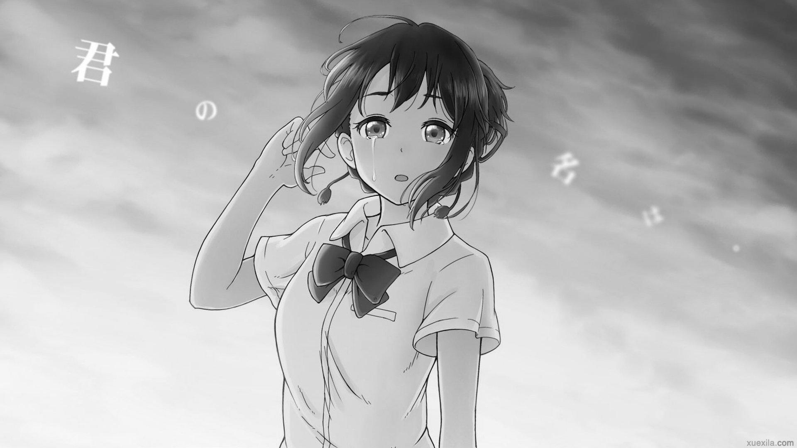
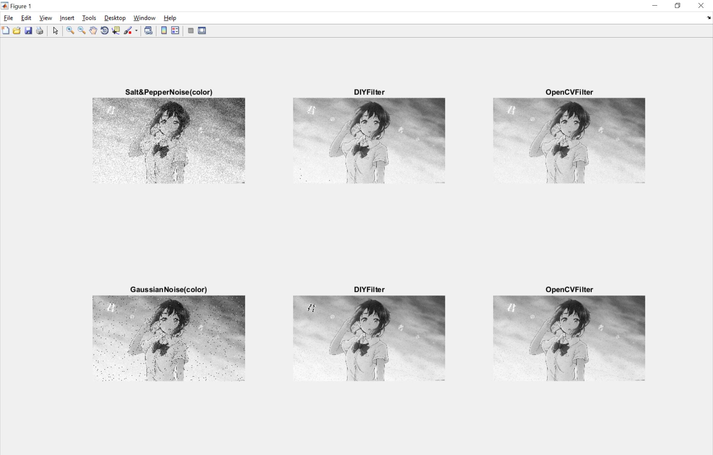
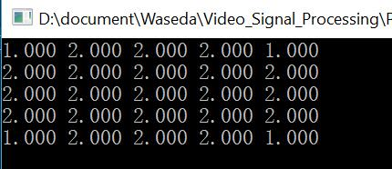
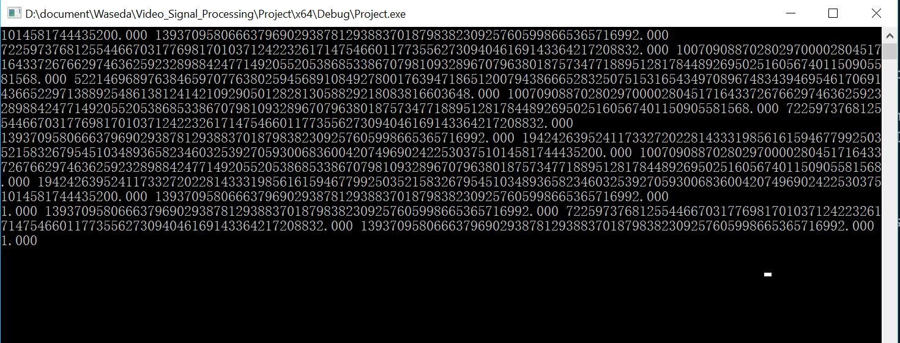
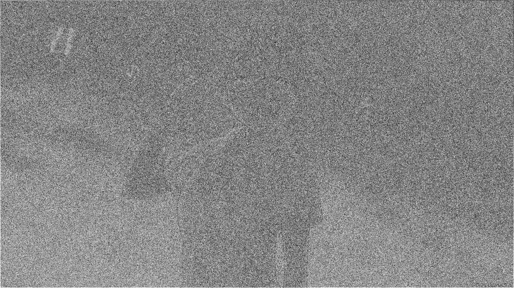

# Video Signal Processing - OpenCV Report
Authored by SONG DAIWEI   #44161588-3

# Subject
I want to research in the Gaussian spatial filter to proccess different pictures, color pictures with different noises(Gaussian noise and Salt & Pepper noise) and gray pictures with different noises. Then I will try different parameter, sigma, in Gaussian function.


# Flow

I use MATLAB to create some pictures as above, [you can see it in this GitHub/Yvon-Shong/Waseda repo](create_picture.m). 

```matlab
P=imread('pic0.jpg');         
imshow(P,[])      

P1=imnoise(P,'gaussian',0.02);     
imshow(P1,[])   
imwrite(P1,'D:\document\Waseda\Video_Signal_Processing\img\1.1.jpg');

P2=imnoise(P,'salt & pepper',0.02); 
imshow(P2,[]) 
imwrite(P2,'D:\document\Waseda\Video_Signal_Processing\img\1.2.jpg');

G=rgb2gray(P);
imshow(G,[])
imwrite(G,'D:\document\Waseda\Video_Signal_Processing\img\2.0.jpg');

G1=imnoise(G,'gaussian',0.02);
imshow(G1,[])    
imwrite(G1,'D:\document\Waseda\Video_Signal_Processing\img\2.1.jpg');

G2=imnoise(G,'salt & pepper',0.02);
imshow(G2,[]) 
imwrite(G2,'D:\document\Waseda\Video_Signal_Processing\img\2.2.jpg');
```

Then I want to compare the processed image with the original algorithm in OpenCV. So in the cpp file writtern by me, I also create the picture by OpenCV.
Of course, I use the same Gaussian function with the same sigma in x and y axis.

I use OpenCV imwrite to output the pictures and show this picture the same time in the report by MATLAB.

```matlab
subplot(2,3,1)
imshow('1.1.jpg')
title('Salt&PepperNoise(color)')

subplot(2,3,2)
imshow('1.1.DIYfilter.jpg')
title('DIYFilter')

subplot(2,3,3)
imshow('1.1.opencvfilter.jpg')
title('OpenCVFilter')

subplot(2,3,4)
imshow('1.2.jpg')
title('GaussianNoise(color)')

subplot(2,3,5)
imshow('1.2.DIYfilter.jpg')
title('DIYFilter')

subplot(2,3,6)
imshow('1.2.opencvfilter.jpg')
title('OpenCVFilter')
```


# Analysis

## Basic concepts
### Gaussian fucntion

$G(x)=\frac{1}{\sqrt{2\pi }\sigma} e^{-\frac{x^2}{2\sigma^2}}$


### 2D-Gaussian fucntion
$G(x,y)=\frac{1}{\sqrt{2\pi }\sigma^2} e^{-\frac{x^2+y^2}{2\sigma^2}}$


### Gaussian kernel

### Discrete Algorithm

$H_{i,j}=\frac{1}{\sqrt{2\pi }\sigma^2} e^{-\frac{(i-k-1)^2+(j-k-1)^2}{2\sigma^2}}$

I use 5*5 grid Gaussian kernel with sigma=1.


### Gaussian function in OpenCV
function prototype
```cpp
void GaussianBlur(InputArray src,OutputArray dst, Size ksize, double sigmaX, double sigmaY=0, intborderType=BORDER_DEFAULT )
```

### Gauss filtering (smoothing) feature
After the completion of the Gauss kernel, the Gauss filter is used to perform the standard convolution.

- the convolution of a Gauss function with another Gauss function is still a Gauss function, A*B=C, the square of the standard deviation of C is the square of the standard deviation of the sum of A and B. It is to say that the convolution of Gauss function is wider, blur effect is more obvious (intuitively, for Gauss fuzzy operation, the image will become increasingly blurred). The convolution of two dimensional Gauss function can be divided into two steps to carry out, the first will be the image convolution with one-dimensional Gauss function, and then the same one-dimensional Gauss function convolutes in the vertical direction. Therefore, computation of two-dimensional Gauss filter grows with filtering template width linearly, instead of square.

- Fourier transform of Gauss function is still a Gauss function, if the original Gauss function is wider (greater standard deviation), Gauss function after transformation will be more narrow (the smaller the standard deviation), that is to say a wider Gauss function, the effect of low pass filter will be more obvious, the processed image detail will be more fuzzy. To make the digital image Gauss blur, that is, we should use a convolution kernel in the distribution of the Gauss function to do convolution operation with the image. We should make sure the size of the standard deviation, the size of the convolution kernel, the size of the final scale factor. The sigma is bigger, Gauss filter band is wider, the degree of smoothing is better.

## Comparision

### Color picture




So you can see that the result in color picture is really bad, maybe because the noise effect in 3 channels is different, so I use the DIY filter to proccess it, and get the bad result.


### Gray picture




You can see that the effect of DIY filter is similar with the original algorithm in OpenCV. But we should pay more attention on the border in DIY filter, you can see the result on the border in DIY filter is really bad, because I have not haddled with the border in the algorithm.

### Gaussian kernel
When we use different Gaussian kernel, we can get different result. As you can see it in the formula of Gaussian function, you can see the effect of the sigma.
So I will try different sigma to proccess the gray picture with Gaussian Noise. 

- when sigma is 10:
the Gaussian kernel makes the picture mixed with its neighbor field averagely. It is a total black picture except the border of the picture.
Its Gaussian kernel module is as follow:



- when sigma is 1:


The result has been shown as above. 

- when sigma is 0.01:


You can see the kernel is out of control, with very very big number in the middle.



So you can see that the sigma is of vital importance for Gaussian function. If it is near 1, the effect will be better.


# Code

```cpp
#include <iostream>
#include <vector>
#include <opencv2/opencv.hpp>
#include <opencv2/core/core.hpp>
#include <cv.h>
#include <highgui.h>
#include <algorithm>
#include <opencv2/highgui/highgui.hpp>
using namespace std;
using namespace cv;
Mat image;
typedef vector<Vec3b> row;
typedef vector<row> mat;
mat in, tmp, output;
double kernel[10][10] = { 0 };
double mins = 999999999;
int w, h;
double pi = 3.14;


Vec3b guessbour(int x, int y) {
	double sum0 = 0, sum1 = 0, sum2 = 0;
	for (int i = 0; i<5; i++)
		for (int j = 0; j<5; j++) {
			Vec3b  tt = tmp[x - 2 + i][y - 2 + j];
			sum0 += tt[0] * kernel[i + 1][j + 1];
			sum1 += tt[1] * kernel[i + 1][j + 1];
			sum2 += tt[0] * kernel[i + 1][j + 1];
		}
	Vec3b tt;
	tt[0] = sum0*mins;
	tt[1] = sum1*mins;
	tt[2] = sum2*mins;
	return tt;
}

void smooth(int iterations)
{
	tmp.resize(h), output.resize(h);
	for (int i = 0; i<h; i++) {
		tmp[i].resize(w), output[i].resize(w);
		for (int j = 0; j<w; j++) {
			output[i][j] = tmp[i][j] = in[i][j];
		}
	}
	while (iterations--) {
		for (int i = 2; i<h - 2; i++)
			for (int j = 2; j<w - 2; j++)
				output[i][j] = guessbour(i, j);
		for (int i = 0; i<h; i++)
			for (int j = 0; j<w; j++) {
				tmp[i][j] = output[i][j];
			}
	}
	Mat res;
	res.create(h, w, image.type());
	for (int i = 0; i<h; i++)
		for (int j = 0; j<w; j++)
			res.at<Vec3b>(i, j) = output[i][j];
	namedWindow("DIYfilter");
	imshow("DIYfilter", res);
	imwrite("D:\\\\document\\Waseda\\Video_Signal_Processing\\img\\DIYfilter.jpg", res);

}

void test()
{
	double n = 5;
	double mid = floor((n + 1) / 2);
	double sigma = 1.0;
	for (int i = 1; i <= n; i++) {
		for (int j = 1; j <= n; j++)
		{
			double ttt = ((i - mid)*(i - mid) + (j - mid)*(j - mid)) / (2 * sigma*sigma);
			double t = exp(-(ttt));
			double  a = t / (2 * pi*sigma*sigma);
			if (a<mins)
				mins = a;
			kernel[i][j] = a;
		}
	}
	for (int i = 1; i <= n; i++)
		for (int j = 1; j <= n; j++)
		{
			kernel[i][j] /= mins;
			kernel[i][j] = ceil(kernel[i][j]);
		}
	for (int i = 1; i <= n; i++) {
		for (int j = 1; j <= n; j++) {
			printf("%.3lf ", (kernel[i][j]));
		}
		cout << endl;
	}
}


void solve()
{
	h = image.rows, w = image.cols;

	in.resize(h);
	for (int i = 0; i<h; i++)
	{
		in[i].resize(w);
		for (int j = 0; j<w; j++)
		{
			in[i][j] = image.at<Vec3b>(i, j);
		}
	}
	smooth(1);
}
void solveinopencv()
{
	namedWindow("original");
	namedWindow("opencvfilter");
	imshow("original", image);
	Mat out;
	GaussianBlur(image, out, Size(5, 5), 1, 1);
	imshow("opencvfilter", out);
	imwrite("D:\\\\document\\Waseda\\Video_Signal_Processing\\img\\opencvfilter.jpg", out);
}
int main()
{
	image = imread("D:\\\\document\\Waseda\\Video_Signal_Processing\\img\\2.2.jpg");
	if (!image.data) {
		cout << "no image data" << endl;
	}
	test();
	solve();

	solveinopencv();

	waitKey();
}

```

# Configuring the environment
[OpenCV 3.1](http://opencv.org/) + Visual Studio 2015

And we unzip it to C:/opencv

### Add to system environment variables
This computer>>right click>>Properties>>Advanced system settings>>Environment Variables...>>Path>>Edit>>New>>add C:/opencv/build/x64/vc14/bin

### Configure the VS 2015
1. Build a Windows ConsoleApplication project
1. Be sure about the **Debug Mode** AND **x64**
1. Then open the PropertySheet properties page in VS2015
VC++ Directory>>Include Directory
    ```
    C:\opencv\build\include;
    C:\opencv\build\include\opencv;
    C:\opencv\build\include\opencv2;
    ```

1. VC++ Directory>>Library Directory
    
    ```
    C:\opencv\build\x64\vc14\lib;
    ```

1. Linker>>input>>Additional Dependency
    ```
    opencv_world310d.lib
    ```
    When in **Release Mode** we should add 
    ```
    opencv_world310.lib
    ```


### Import the PopertySheet file

Also we can import the [DebugPropertySheet.props](DebugPropertySheet.props) to configure the environment of OpenCV in Visual Studio 2015 of Debug Mode.

[ReleasePropertySheet.props](ReleasePropertySheet.props) for Release Mode


## Tips
When using OpenCV to process image and debug, there will be some error about running out of memory or crashing. It results from the path of image. We should use 
```
"D:\\\\pic.jpg"
```
instead of 
```
"D:\\pic.jpg"
```

